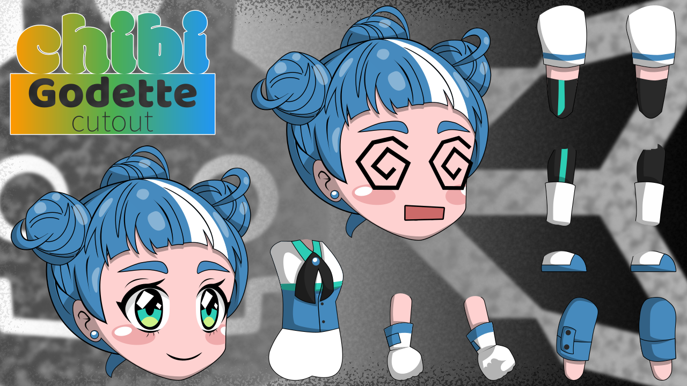
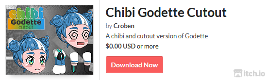

# WHAT IS CHIBI GODETTE CUTOUT?

Chibi Godette Cutout is a game asset base on [Godette](https://github.com/godotengine/godot-design/tree/master/godette), a character made by Andrea Calabrò for the [Godot](https://godotengine.org/) game engine, under [CC BY 4.0 International license](https://github.com/godotengine/godot-design/blob/master/LICENSE). And as the name of this asset suggests, it is a chibi(short/small) and a cutout version of the original artwork.

# VIDEO PREVIEW

# ASSET CONTENTS

1. Chibi Godette Cutout
    - 128 x 256 pixels
    - 256 x 512 pixels
    - 512 x 1024 pixels

2. Animations
    - Idle
    - Walk
    - Run
    - Jump
    - Fall
    - Dash
    - Death

3. Godot Asset ZIP File (Godot v3.2.2)
    - Chibi Godette 128 x 256 pixels scene 
    - Chibi Godette 256 x 512 pixels scene
    - Chibi Godette 512 x 1024 pixels scene
    - Demo scene
    - Animations

4. Unity Package (Unity 2019.3.0f3)
    - Chibi Godette prefab
    - Demo scene
    - Animations

# HOW TO IMPORT?

### With Godot open
   - Go to “AssetLib”
   - Click “Import”
   - Locate “Godot-Chibi-Godette-Cutout.zip”
   - Click “Open”
   - Click “Install”

### With Unity open
   - Click “Assets”
   - Go to “Import Package”
   - Click “Custom Package…”
   - Locate “Unity-Chibi-Godette-Cutout.unitypackage”
   - Click “Open”
   - Click “Import”

# FRIENDLY TIPS

1. Create A “Sprite Atlas”
    - On Godot follow this [guide](https://godotengine.org/article/atlas-support-returns-godot-3-2)
    - On Unity follow this [guide](https://docs.unity3d.com/Manual/SpriteAtlasWorkflow.html)

2. Smaller Size In Unity
    - To have a smaller size variant in Unity, simply override the “Max Size” then scale down the graphic of the prefab.
    
    

